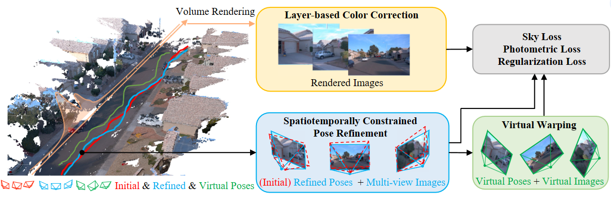

<div align="center">

  <h1 align="center">UC-NeRF: Neural Radiance Field for Under-Calibrated Multi-view Cameras in Autonomous Driving</h1>

### [Project Page](https://kcheng1021.github.io/ucnerf.github.io/)

</div>

## 🖼️ Demo
<div align="center">

</div>

## 📖 Abstract

Multi-camera setups find widespread use across various applications, such as au-
tonomous driving, as they greatly expand sensing capabilities. Despite the fast
development of Neural radiance field (NeRF) techniques and their wide applica-
tions in both indoor and outdoor scenes, applying NeRF to multi-camera systems
remains very challenging. This is primarily due to the inherent under-calibration
issues in multi-camera setup, including inconsistent imaging effects stemming
from separately calibrated image signal processing units in diverse cameras, and
system errors arising from mechanical vibrations during driving that affect rela-
tive camera poses. In this paper, we present UC-NeRF, a novel method tailored
for novel view synthesis in under-calibrated multi-view camera systems. Firstly,
we propose a layer-based color correction to rectify the color inconsistency in
different image regions. Second, we propose virtual warping to generate more
viewpoint-diverse but color-consistent virtual views for color correction and 3D
recovery. Finally, a spatiotemporally constrained pose refinement is designed for
more robust and accurate pose calibration in multi-camera systems. Our method
not only achieves state-of-the-art performance of novel view synthesis in multi-
camera setups, but also effectively facilitates depth estimation in large-scale out-
door scenes with the synthesized novel views.


## 🗓️ TODO
- [✔] Pose Refinement codes
- [✔] End-to-end UC-NeRF training
- [✔] Depth prior for virtual warping
- [✔] bash scripts for training, testing and rendering

## 🚀 Setup
```
# Clone the repo.
git clone https://github.com/kcheng1021/UC-NeRF.git
cd nerf

# Make a conda environment.
conda create --name ucnerf python=3.9
conda activate ucnerf

# Install requirements.
pip install -r requirements.txt

# Install other cuda extensions
pip install ./gridencoder

# Install nvdiffrast 
git clone https://github.com/NVlabs/nvdiffrast
pip install ./nvdiffrast

# Install a specific cuda version of torch_scatter 
# see more detail at https://github.com/rusty1s/pytorch_scatter
CUDA=cu113
pip install torch-scatter -f https://data.pyg.org/whl/torch-1.12.0+${CUDA}.html
```

## 🚀 Dataset demo

Here we present a sample Waymo scene in [Waymo-100613](https://drive.google.com/file/d/13kmc01KWUINgF5zHONJCYO7OPaWnLbrG/view?usp=drive_link).

The detail tutorial of the preprocessing of Waymo dataset can be refered in [StreetSurf](https://github.com/PJLab-ADG/neuralsim/tree/main/dataio/autonomous_driving/waymo).


## 🚀 Start up

```
# getting the refined poses
cd pose_refinement
# following the instruction in the submodule

# getting the depth for virtual warping
cd mvs
# following the instruction in the submodule

cd nerf

# including the bash scripts of train, eval nerf model, and render video
bash scripts/train_waymo.sh
```


## 🚀 Pipeline

<div align="center">

</div>

## 🎫 License

For non-commercial use, this code is released under the [LICENSE](LICENSE).
For commercial use, please contact Xuejin Chen.

## 🖊️ Citation


If you find this project useful in your research, please consider cite:


```BibTeX
@inproceedings{cheng2023uc,
  title={UC-NERF: Neural Radiance Field for under-calibrated multi-view cameras},
  author={Cheng, Kai and Long, Xiaoxiao and Yin, Wei and Wang, Jin and Wu, Zhiqiang and Ma, Yuexin and Wang, Kaixuan and Chen, Xiaozhi and Chen, Xuejin},
  booktitle={The Twelfth International Conference on Learning Representations},
  year={2023}
}
```

----
## Acknowledgements
Thanks to [Zip-NeRF-Pytorch](https://github.com/SuLvXiangXin/zipnerf-pytorch) for amazing zipnerf pytorch implementation. Thanks to [COLMAP](https://github.com/colmap/colmap) and [CER-MVS](https://github.com/princeton-vl/CER-MVS) for providing the foundation for our work. 


